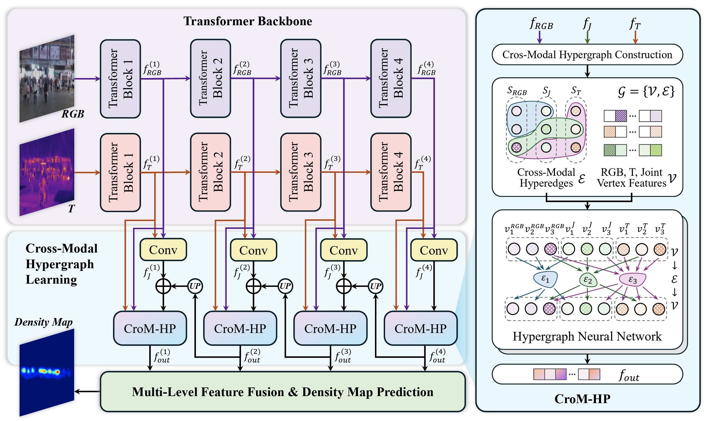

<p align="center">
    
<p>
<h2 align="center">HyperCounter: Cross-Modal Hypergraph Fusion for RGB-T Crowd Counting</h2>


<p align="center">
  Implementation of the paper "HyperCounter: Cross-Modal Hypergraph Fusion for RGB-T Crowd Counting".
</p>


## Overview🔍
<div>
    
</div>

**Figure 1. The framework of the proposed HyperCounter.**


**_Abstract -_** In RGB-T crowd counting, the performance of existing methods is often constrained by two major challenges. On the one hand, the inherent spatial misalignment between RGB and thermal infrared images makes cross-modal feature alignment and fusion extremely difficult. On the other hand, effectively integrating the complementary semantic information from both modalities and capturing their complex high-order associations remains a significant challenge. To address these issues, we propose a novel framework based on cross-modal hypergraph fusion (HyperCounter), which, for the first time, introduces hypergraph learning into the field of cross-modal visual recognition. Specifically, we utilize parallel Transformer backbones to extract multi-scale features and employ convolutional blocks to preliminarily fuse the features from both modalities into joint features. Subsequently, we design a cross-modal hypergraph perception module (CroM-HP), where feature patches are treated as vertices, and a cross-modal hypergraph is constructed based on the joint and cross-modal features. Hypergraph neural networks are then used to achieve efficient semantic information interaction and fusion. Through CroM-HP, the model can associate corresponding regions across modalities in a spatially flexible manner and fully understand the intricate complementary semantic correlations. Moreover, a pyramid structure is adopted in the multi-level CroM-HPs to achieve cross-scale semantic transmission. Experiments on two widely used datasets, RGBT-CC and Drone-RGBT, demonstrate that our framework achieves the best performance, significantly outperforming previous methods. In particular, compared to the second-place method on the Drone-RGBT dataset, HyperCounter improves the GAME(0) and RMSE metrics by 7.58\% and 9.71\%, respectively.

## Datasets📚

We evaluate the proposed method on two widely used RGB-T crowd counting datasets: [🔗RGBT-CC](https://github.com/chen-judge/RGBTCrowdCounting) and [🔗Drone-RGBT](https://github.com/VisDrone/DroneRGBT). 

The RGBT-CC dataset contains annotations for 138,389 pedestrians across 2,030 pairs of RGB-Thermal images. It features a variety of scenes, such as streets, shopping malls, amusement parks, and train stations, as well as diverse lighting conditions including daytime, nighttime, and indoor environments. Drone-RGBT is an aerial RGB-T crowd counting dataset captured by drones, comprising 3,607 image pairs with 175,698 annotated instances. This dataset also encompasses a wide range of scenes, such as campuses, parks, parking lots, and playgrounds, under various lighting conditions. 

## Experimental Results🏆

[//]: # (![img.png]&#40;figures/comp_1.png&#41;)

[//]: # (![img.png]&#40;img.png&#41;)

**Table 1. Comparison with other state-of-the-art methods on the RGBT-CC dataset.**
| Method         | Venue    | Backbone        | GAME(0) | GAME(1) | GAME(2) | GAME(3) | RMSE  |
|----------------|----------|-----------------|---------:|--------:|--------:|--------:|------:|
| MMCCN          | ACCV'20  | ResNet-50       |   13.82 |   17.83 |   22.20 |   29.64 | 24.36 |
| BBS-Net        | ECCV'20  | ResNet-50       |   19.56 |   25.07 |   31.25 |   39.24 | 32.48 |
| BL+IADM        | CVPR'21  | VGG-19          |   15.61 |   19.95 |   24.69 |   32.89 | 28.18 |
| BL+MAT         | ICME'22  | VGG-19          |   13.61 |   18.08 |   22.79 |   31.35 | 24.48 |
| DEFNet         | ITS'22   | VGG-16          |   11.90 |   16.08 |   20.19 |   27.27 | 21.09 |
| MSDTrans       | BMVC'22  | PoolFormer      |   10.90 |   14.81 |   19.02 |   26.14 | 18.79 |
| MC3Net         | ITS'23   | ConvNext        |   11.47 |   15.06 |   19.40 |   27.95 | 20.59 |
| CGINet         | EAAI'23  | ConvNext        |   12.07 |   15.98 |   20.06 |   27.73 | 20.54 |
| MJPNet-T       | IoT'24   | SegFormer       |   11.56 |   16.36 |   20.95 |   28.91 | 17.83 |
| MCN            | ESWA'24  | PoolFormer      |   11.56 |   15.92 |   20.16 |   28.06 | 19.02 |
| GETANet        | GRSL'24  | PVT             |   12.14 |   15.98 |   19.40 |   28.61 | 22.17 |
| BGDFNet        | TIM'24   | VGG-16          |   11.00 |   15.04 |   19.86 |   29.72 | 19.05 |
| VPMFNet        | IoT'24   | VGG-16          |   10.99 |   15.17 |   20.07 |   28.03 | 19.61 |
| BMCC           | ECCV'24  | VGG-19 & ViT    |   10.19 |   13.61 |   17.65 |   23.64 | 17.32 |
| SAM-Guided     | ICMR'24  | SAM             |   10.51 |   14.52 |   18.92 |   26.28 | 17.71 |
| CSCA           | PR'25    | VGG-19          |   13.50 |   18.63 |   23.59 |   31.59 | 24.83 |
| MISF-Net       | TMM'25   | VGG-16          |   10.90 |   14.87 |   19.65 |   29.18 | 19.42 |
| CMFX           | NN'25    | VGG-19          |   11.25 |   15.33 |   19.62 |   26.14 | 19.38 |
| **HyperCounter** | -      | **PVT**         | **9.94** | **13.11** | **17.36** | **23.63** | **16.38** |


**Table 2. Comparison with other state-of-the-art methods on the Drone-RGBT dataset.**
| Method        | Venue      | Backbone            | GAME(0) | GAME(1) | GAME(2) | GAME(3) | RMSE  |
|---------------|------------|---------------------|--------:|--------:|--------:|--------:|------:|
| CSRNet        | CVPR 2018  | VGG-16              |    8.91 |      -  |      -  |      -  | 13.80 |
| MMCCN         | ACCV 2020  | ResNet-50           |   20.63 |   12.76 |   14.00 |   15.73 | 18.22 |
| BL+IADM       | CVPR 2021  | VGG-19              |    9.77 |   12.91 |   17.08 |   22.61 | 15.76 |
| DEFNet        | TITS 2022  | VGG-16              |   10.87 |      -  |      -  |      -  | 17.93 |
| MC3Net        | TITS 2023  | ConvNext            |    7.33 |      -  |      -  |      -  | 11.17 |
| CGINet        | EAAI 2023  | ConvNext            |    8.37 |    9.97 |   12.34 |   15.51 | 13.45 |
| BMCC          | ECCV 2024  | VGG-19 & ViT        |    6.20 |      -  |      -  |      -  | 10.40 |
| GETANet       | GRSL 2024  | PVT                 |    8.44 |   10.01 |   12.75 |   15.83 | 13.99 |
| CSCA          | PR 2025    | VGG-19              |    9.51 |   12.12 |   15.84 |   21.57 | 15.19 |
| CMFX          | NN 2025    | VGG-19              |    6.75 |    8.88 |   11.87 |   14.69 | 11.05 |
| **HyperCounter** | -       | **PVT**             | **5.73**|**7.25** |**9.41** |**12.63**|**9.39** |

<br> </br>

<div>
    
</div>

**Figure 2. Visualization of the model input, output, and intermediate features. a) The input RGB image and the ground truth count; b) The input thermal image; c) The feature map output from the RGB branch backbone; d) The feature map output from the thermal image branch backbone; e) The feature map after preliminary fusion, i.e., the joint feature; f) The feature map output from CroM-HP; g) The predicted density map and count result. It is clearly observed that the feature map output from CroM-HP, compared to the joint feature, remove most of the redundant features, highlighting the crowd characteristics and effectively eliminating non-human heat sources.**


## Getting Started🚀

### 1. Data Preparation

#### (1) RGBT-CC Dataset

The RGBT-CC dataset can be downloaded from [🔗here](https://github.com/chen-judge/RGBTCrowdCounting).
We provide the preprocessing script `preprocess_RGBTCC.py` for the RGBT-CC dataset. After running the script, the dataset should be organised as follows:

```text
RGBT_CC
├── train
│   ├── 1162_RGB.jpg
│   ├── 1162_T.jpg
│   ├── 1162_GT.npy
│   ├── 1164_RGB.jpg
│   ├── 1164_T.jpg
│   ├── 1164_GT.npy
│   ├── ...
├── val
│   ├── 1157_RGB.jpg
│   ├── 1157_T.jpg
│   ├── 1157_GT.npy
│   ├── ...
├── test
│   ├── 1197_RGB.jpg
│   ├── 1197_T.jpg
│   ├── 1197_GT.npy
│   ├── ...
```

#### (2) Drone-RGBT Dataset
The Drone-RGBT dataset can be downloaded from [🔗here](https://github.com/VisDrone/DroneRGBT).
It should be organised as follows:
```text
Drone_RGBT
├── train
│   ├── GT_
│   │   ├── 1R.xml
│   │   ├── 2R.xml
│   │   ├── ...
│   ├── RGB
│   │   ├── 1.jpg
│   │   ├── 2.jpg
│   │   ├── ...
│   ├── Infrared
│   │   ├── 1R.jpg
│   │   ├── 2R.jpg
│   │   ├── ...
├── test
│   ├── GT_
│   │   ├── 1R.xml
│   │   ├── 2R.xml
│   │   ├── ...
│   ├── RGB
│   │   ├── 1.jpg
│   │   ├── 2.jpg
│   │   ├── ...
│   ├── Infrared
│   │   ├── 1R.jpg
│   │   ├── 2R.jpg
│   │   ├── ...
```
### 2. Environment Setup

Detailed requirements are provided in the `requirements.txt` file.
The core libraries are as follows:
```text
torch: 1.11.0+cu113
torchvision: 0.12.0+cu113
timm: 1.0.12
mmcv-full: 1.7.2
mmdet: 3.3.0 (dev)
mmengine: 0.10.5
numpy: 1.22.4
scipy: 1.10.1
scikit-learn: 1.3.2
```

### 3. Training

The `train.py` script is used to train the model, where you can see all the hyperparameters and configurations. For convenience, we provide a bash script `train.sh` to train the model. You should set the `--data-dir` and `--dataset` to your dataset path and name. We recommend using the default hyperparameters for training.
It is worth noting that we provide two methods to build the cross-modal hypergraph, based on k-Nearest Neighbor and epsilon-Ball Neighbor. In `train.py`, you can choose which method to use by `--constr-hg`, and set the k value or epsilon value by `--constr-k` or `--constr-threshold`. Epsilon-Ball Neighbor is the recommended method.

We use the PVT-v2-b3 from Pyramid Vision Transformer (PVT) series as the backbone network. It is pretrained on ImageNet-1k. 
You can download the pre-trained PVT model from [🔗here](https://drive.google.com/file/d/1PzTobv3pu5R3nb3V3lF6_DVnRDBtSmmS/view?usp=sharing). The PVT repository: [🔗PVT](https://github.com/whai362/PVT/tree/v2/classification). 
After downloading it, put the `pvt_v2_b3.pth` file in the `pretrained_weights` folder.

When everything is ready, you can start training by running the following command:
```bash
bash train.sh
```


### 4. Testing

The `test.py` script is used to evaluate the model and generate the prediction results. We provide a bash script `test.sh` to conviently test the model. You should set the `--data-dir`, `--dataset`, `--model-path` to your dataset path, dataset name, and model path. Additionally, the same as training, you should choose the method to build the cross-modal hypergraph by `--constr-hg`, and set the k value or epsilon value by `--constr-k` or `--constr-threshold`.

When everything is ready, you can start testing by running the following command:
```bash
bash test.sh
```


## Cite our work📝
```bibtex
Coming soon...
```

## License📜
The source code is free for research and education use only. Any comercial use should get formal permission first.

